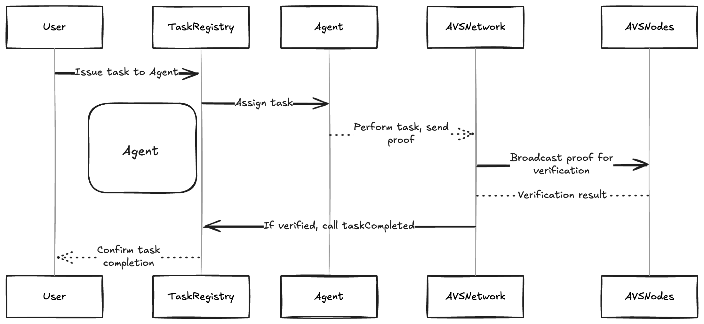

Ensemble AVS Example

This repository demonstrates how to implement a simple price oracle AVS using the Othentic Stack.

---

## Table of Contents

- [Table of Contents](#table-of-contents)
- [Overview](#overview)
  - [Features](#features)
- [Project Structure](#project-structure)
- [Architecture](#architecture)
- [Prerequisites](#prerequisites)
- [Installation](#installation)
- [Usage](#usage)
  - [Next](#next)

---

## Overview

The Simple Price Oracle AVS Example demonstrates how to deploy a minimal AVS using Othentic Stack.


### Features

- **Containerised deployment:** Simplifies deployment and scaling.
- **Prometheus and Grafana integration:** Enables real-time monitoring and observability.

## Project Structure

```mdx
📂 simple-price-oracle-avs-example
├── Execution_Service  # Implements task execution logic
├── Validation_Service # Implements task validation logic
├── grafana            # Grafana monitoring configuration
├── docker-compose.yml # Docker setup for Operator Nodes (Performer, Attesters, Aggregator), Execution Service, Validation Service, and monitoring tools
└── README.md          # Project documentation
```

## Architecture



The Performer node executes tasks using the Task Execution Service and sends the results to the p2p network.

Attester Nodes validate task execution through the Validation Service. Based on the Validation Service's response, attesters sign the tasks. In this AVS:

Task Execution logic:
- Fetch the ETHUSDT price.
- Store the result in IPFS.
- Share the IPFS CID as proof.

Validation Service logic:
- Retrieve the price from IPFS using the CID.
- Get the expected ETHUSDT price.
- Validate by comparing the actual and expected prices within an acceptable margin.
---

## Prerequisites

- Node.js (v 22.6.0 )
- Foundry
- [Yarn](https://yarnpkg.com/)
- [Docker](https://docs.docker.com/engine/install/)

## Installation

1. Clone the repository:

   ```bash
   git clone https://github.com/Othentic-Labs/simple-price-oracle-avs-example.git
   cd simple-price-oracle-avs-example
   ```

2. Install Othentic CLI:

   ```bash
   npm i -g @othentic/othentic-cli
   ```

## Usage

Follow the steps in the official documentation's [Quickstart](https://docs.othentic.xyz/main/avs-framework/quick-start#steps) Guide for setup and deployment.

### Next
Modify the different configurations, tailor the task execution logic as per your use case, and run the AVS.

Happy Building! 🚀

